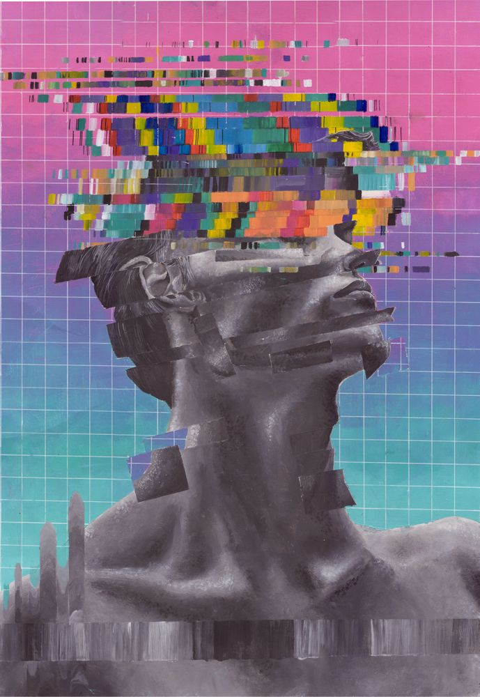
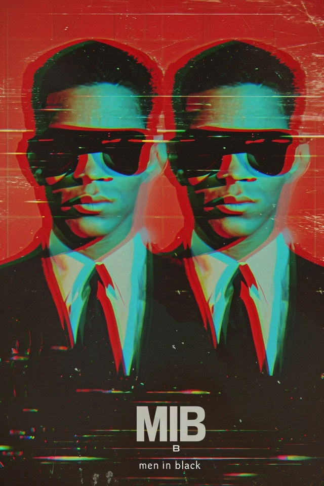

# ldai0199_quiz_8
My week 8 quiz

## Part 1: Chosen Technique Inspiration - *Glitch Art*

Glitch art involves intentionally distorting images to create visually striking and unexpected results. I find the chaotic and unpredictable nature of glitches or distortion fields fascinating, allowing for mesmerizing animation effects. I want to incorporate this aesthetic by applying distortion algorithms or utilizing noise functions to generate dynamic distortions that continuously evolve over time, resulting in a visually engaging experience for the viewer into my project to add an element of surprise and unpredictability. 

**High Quality Images Examples:**

Example 1:

Example 2:

## Part 2: Coding Technique Exploration

