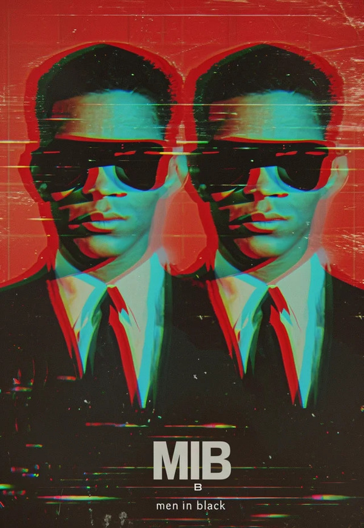
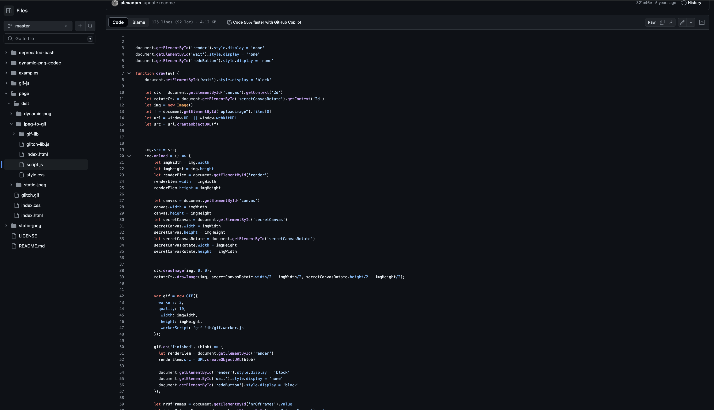

# ldai0199_Quiz_8

## Part 1: Chosen Technique Inspiration - *Glitch Art*
Glitch art involves intentionally distorting images to create visually striking and unexpected results. I find the chaotic and unpredictable nature of glitches or distortion fields fascinating, allowing for mesmerizing animation effects. I want to incorporate this aesthetic by applying distortion algorithms or utilizing noise functions to generate dynamic distortions that continuously evolve over time, resulting in a visually engaging experience for my viewers, hoping to add an element of surprise and unpredictability into my final project.

### High Quality Images Examples:

### *Example 1:*

### *Example 2:*

## Part 2: Coding Technique Exploration
After researching online, I came across a coding technique example that utilizes HTML5 Canvas and the GIF.js library to dynamically manipulate images and produce glitch art GIFs. This example, which I intend to explore further for my project, incorporates distortion algorithms, random glitch effects, and canvas rotations to achieve visually striking and unpredictable glitch animations. Leveraging asynchronous functions ensures smooth execution, enhancing user interaction. This coding approach not only facilitates the implementation of glitch art but also aligns seamlessly with the desired imaging technique, creating captivating glitch art animations with ease.

### *Screenshot Example:*

[Link to implentation](https://raw.githubusercontent.com/alexadam/glitch-studio/master/examples/monalisa-glitch.gif)

[Link to example code](https://github.com/alexadam/glitch-studio/blob/master/page/dist/jpeg-to-gif/script.js)
